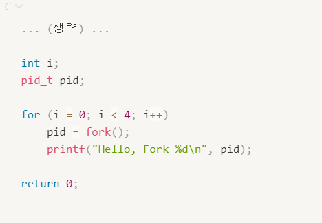

#  Processes

##  Documents

 

| 작성자 | 내용 | 주소 |
|:----:|:-----:|:-----:|
| 김상호 | 3장 정리| [Link]()|

 

##  Summary

--------------------------------------
 

##   Questions

 

|Question|Answer|
|--------------|--------------|
|1. Message Passing의 경우 OS가 개입해서 message를 전달해주는 시스템을 형성해준다는데, Shared Memory의 경우에도 공유 메모리 공간을 OS가 개입해서 만드는데, 무슨 의미로 유난히 Message Passing에만 '개입'이라는 단어를 사용한걸까? ?| [Link]()|
|2. 3.32_process_creation6.c 부분을 설명하시면서 이 코드에 대한 결과값으로 pid가 30개가 출력이 되더라구요.. 강사님께서도 예상하는 갯수랑 다를거다 이런식으로 말씀하셔서 왜 저희가 생각한대로의 갯수가 출력되지 않는지 아시는 분 있으시면 설명 부탁드립니다!
  | [Link](https://m.blog.naver.com/PostView.naver?isHttpsRedirect=true&blogId=wndrlf2003&logNo=70187577389) |
|3. 스택(Stack), 힙(Heap), 데이터(Data)영역 | [Link](https://dsnight.tistory.com/50) |
